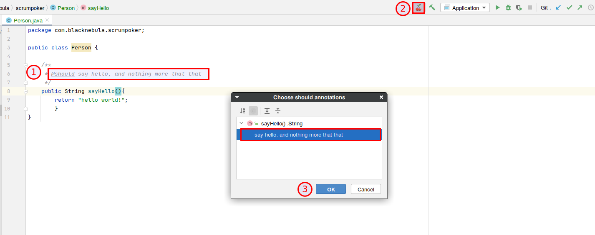
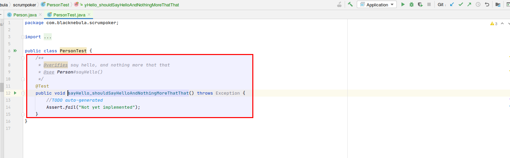
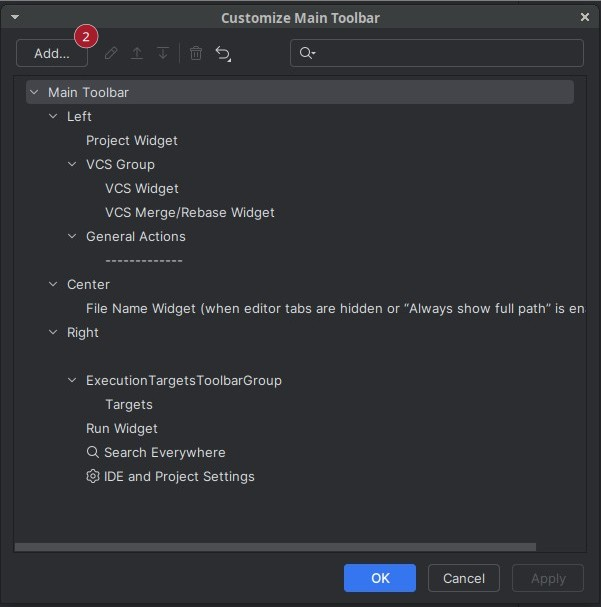
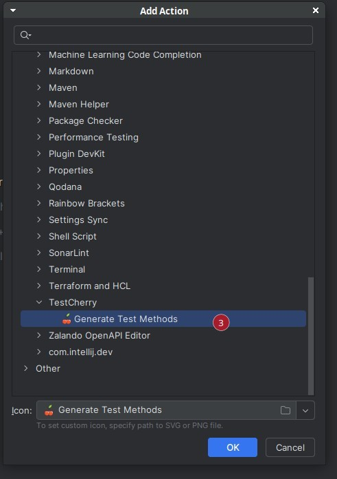

<h1>Test Cherry  Plugin </h1>

This Project is based on <a href="https://github.com/hablutzel1/GenerateTestCases">GenerateTestCases</a> project.


<h2>What it does?</h2>

**Test Cherry Plugin** aides java developers with writing **@should** style test units.

It aims to make it easier to make **TDD** with a really cool and easy approach that consist in
 annotating interface method with desired behaviours like this:
```java
public interface Person {

    /**
     *
     * @return
     * @should say hello, and nothing more that that
     */
    String sayHello();
}
```

So with this plugin you could generate a test class for this interface like this one automatically:
```java
import org.junit.Assert;
import org.junit.Test;

public class PersonTest {

	/**
	 * @see Person#sayHello()
	 * @verifies say hello, and nothing more that that
	 */
	@Test
	public void sayHello_shouldSayHelloAndNothingMoreThatThat() throws Exception {
		//TODO auto-generated
		Assert.fail("Not yet implemented");
	}
}
```

And then test your implementation code like this
```java
    public void sayHello_shouldSayHelloAndNothingMoreThatThat() throws Exception {
        assertThat(intance.sayHello(), is("hello world"));
    }
```

This way you can realize that for testing this behaviour you just wrote the @should annotation in the sut (system under test) in a really
descriptive way.
```java
    /**
     *
     * @return
     * @should say hello, and nothing more that that
     */
    String sayHello();
```
Auto-generated the test class and test method (using the plugin) and then tested the actual expected behaviour with (hamcrest style junit test):
```java
     assertThat(intance.sayHello(), is("hello world"));
```
Nothing more.

<h2>How to install</h2>

You can download the plugin "**testCherry**" directly from the IDE. 
* Go to **Settings > Plugin** enter "**testCherry**" 
* Hit enter 
* Select the plugin and press install.

<h2>How to use</h2>

* Open class in editor
* Add some test use cases using **@should** style annotation in method javadoc
* Press the "Generate Test Methods"  button in toolbar to generate test methods for each test use case.

* A unit test will be generated automatically


<h2>How to test from source code</h2>

* Clone repository
* run ```gradlew runIde```


<h2>How to build</h2>

* run ```gradlew build```

<h2>Change Notes</h2>

**3.17**
* Support build range `242.*`

**3.16**
* Specify plugin display name in settings. Move plugin config under `Settings > Tools`

**3.15**
* Remove  internal and scheduled for removal API usages

**3.14**
* Support build range `241.*`

**3.13**
* Add support for IntelliJ IDEA version **2023.3**

**3.12**
* Add support for IntelliJ IDEA version **2023.2**

**3.11**
* Add support for IntelliJ IDEA version **2023.1**

**3.10**
* Add support for IntelliJ IDEA version **2022.3**

**3.9**
* Add support for IntelliJ IDEA version **2022.2**

**3.8**
* Add support for IntelliJ IDEA version **2021.3**

**3.7**
* Add support for IntelliJ IDEA version **2021.2**

**3.6**
* Fixing a NullPointerException that is thrown in IntelliJ Idea
* Fixing outOfBoundException when generating a test case
* adding a comment tag for verifies to prevent the warnings

**3.5**
* Support for snake case test cases generation

**3.4**
* Add support for IntelliJ IDEA version **2021.1**

**3.1**
* fix multiple test method generation

**3.0**
* Add support to IntelliJ IDEA version **2020.3**
* Reduce deprecated methods usage 

**2.0**
* Fix at should comment rename
* Fix test lib initialization
* Add plugin icon

**1.0**
* Implement test case generation for with IntelliJ IDEA version **2020.2**

<h2>Known issues</h2>
<h3>Add Test Cherry icon to main Toolbar </h3>







<h3>Java doc generation Workaround</h3>
When generating javadoc from code, the javadoc tool generates errors while encountering the TestCherry tags:

> error: unknown tag: should
> error: unknown tag: verifies

This can be solved by adding the following to the javadoc commandline:
`-tag should:a:"Should:" -tag verifies:a:"Verifies:"`

In IntelliJ, this could be done by adding it at the 'Other command line arguments'


<h2>Credits</h2>

* To <a href="https://github.com/hablutzel1/GenerateTestCases">GenerateTestCases</a> project author <a href="https://github.com/hablutzel1">Jaime Hablutzel</a>.
* To <a href="https://wiki.openmrs.org/display/docs/Generate+Test+Case+Plugin">OpenMRS</a> team for @should style testing.
* To <a href="https://github.com/Fontyschriek">@Fontyschriek</a> for his suggestions to improve the plugin.
* To <a href="https://github.com/yanislavm">@yanislavm</a> for his valuable improvements.
